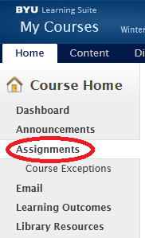
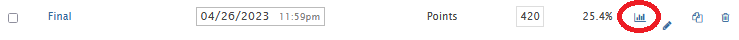
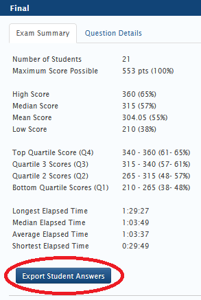

# Analyzer
This project analyzes multiple-choice exam questions.

Usage: python analyzer/question_analyzer.py analyzer_config.yml scores.csv output.txt

# Getting scores from Learning Suite
Open your course on Learning Suite. 

Click on Assignments in the left panel 

Open the exam details 

Download the exam scores 

# Measures

## Discrimination
proportion that answered correctly (p)

proportion that answered incorrectly (q)

Mean score of those that answered correctly (M1)

Mean score of those that answered incorrectly (M0)

Discrimination ((M1-M0)/SD)/SQRT(p*q)

## Difficulty
https://www.researchgate.net/publication/323705126

Number in the top quartile who answered the item correctly (RU)

Number in the bottom quartile who answered the item correctly (RL)

The number in both the bottom and top quartiles (T)

Item difficulty (p = (RU+RL)/T*100))

DIF > 70% = Easy, 30-70% = Average, 50-60% Good, <30% = Too difficult

## Understanding
Below 50% correct

Most picked a single wrong answer

Q4 students below 75% correct

Q4 students below 50% correct

Q4 students below 25% correct

Start at 5 and subtract 1 for each yes to the above questions
